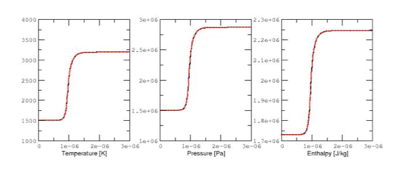
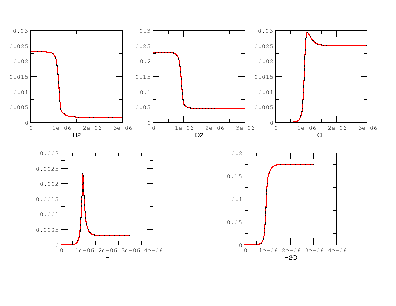
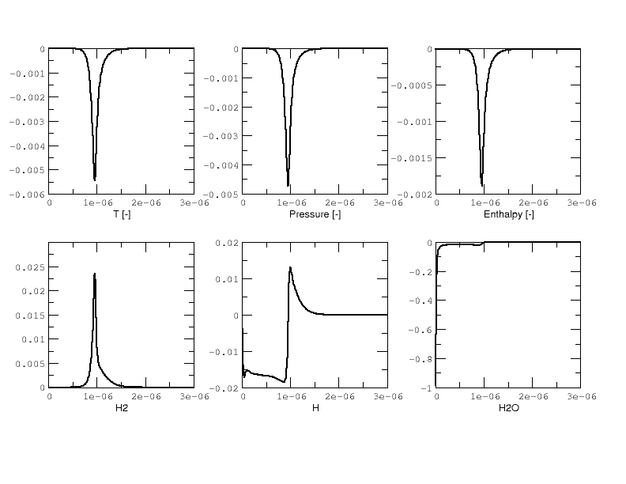
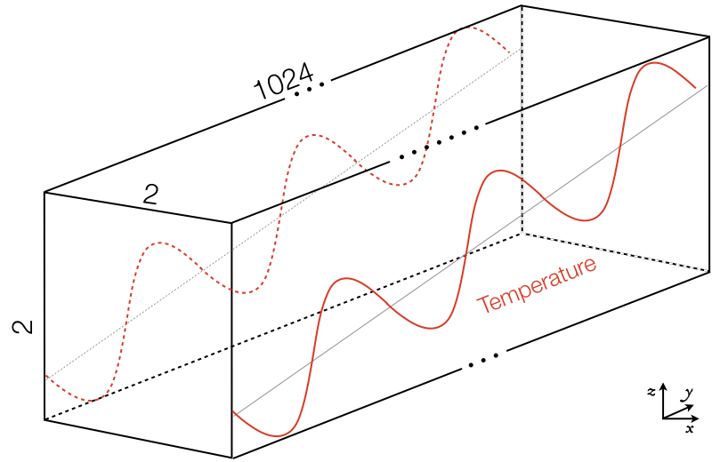
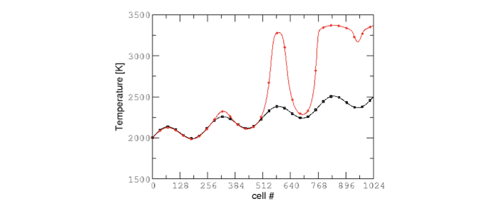
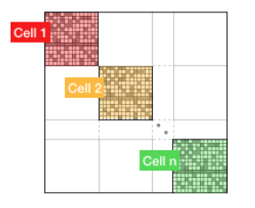

.. highlight:: rst

.. role:: cpp(code)
   :language: c++

CVODE implementation in `PelePhysics`
======================================

.. _sec:subsDiffReacts:

The different reactors
-----------------------

Throughout this document, what we call a `reactor` is in fact a zero-dimensional model, 
the simplest representation of a chemically reacting system. Depending upon the choice of state variables 
driving the system, several different types of reactor can be considered; 
and the "correct" choice is case dependent. In general, the state variables for a reactor model are

- The reactor mass
- The reactor volume
- The energy of the system
- The mass fractions for each species

The most common type of reactor is the `constant-volume` (CV) reactor, which is the one used to advance the chemistry 
within `PeleC`. This reactor type is equivalent to a rigid vessel with fixed volume but variable pressure. 
In `PelePhysics`, the constant-volume constraint is ensured by keeping the density :math:`\rho` fixed 
-since there is no change of mass; and the indirect choice of energy in the CV reactor implementation is the total energy 
:math:`E`. :math:`E`'s evolution in our case is solely due to a constant external source term :math:`\dot{E}_{ext}`, which accounts 
for the effects of advection and convection in the Spectral Deferred Correction (SDC) scheme that all `Pele` codes use (see the `PeleLM <https://pelelm.readthedocs.io/en/latest/index.html>`_ documentation for example). 
In that sense, the CV reactor is an abstraction and is not a true closed vessel.

Note that CVODE still integrates the mass fractions (:math:`\rho Y`) together with energy for stability reasons, 
but a change of variable is applied to effectively transport the temperature :math:`T` via

.. math::

    \rho C_v \frac{\partial T}{\partial t} = \rho\dot{E}_{ext}  - \sum_k e_k {\dot{\omega}_k}^M

where the :math:`e_k` are the species internal energy and :math:`{\dot{\omega}_k}^M` is the species :math:`k` mass production rate. 

In a second implementation, that we will label `constant-volume-enthalpy` (CVH), the mass-weighted total enthalpy :math:`\rho H` is used and 
conserved along with :math:`\rho`. This reactor type is also an abstraction. Here also, :math:`\rho H` 
evolves according to an external source term :math:`\dot{\rho H}_{ext}`, and in CVODE, the mass fractions (:math:`\rho Y`) and 
temperature :math:`T` are integrated according to

.. math::

    \rho C_p \frac{\partial T}{\partial t} = \rho\dot{H}_{ext}  - \sum_k h_k  {\dot{\omega}_k}^M

where the :math:`h_k` are the species internal energy. 

.. _sec:subsubValidCVreact:

Validation of the CV reactor implementation in CVODE (with CANTERA)
^^^^^^^^^^^^^^^^^^^^^^^^^^^^^^^^^^^^^^^^^^^^^^^^^^^^^^^^^^^^^^^^^^^^^^^^

`CANTERA <https://cantera.org/>`_ is an open-source suite of tools for problems involving chemical kinetics, thermodynamics, and transport processes. 
It is a very robust and fast tool written in C++ that is also based on CVODE to perform the chemistry integration. 
CANTERA is well recognized in the combustion community, and by comparing our results to CANTERA reactor simulations, 
we will be able to validate our implementation. 

Note that only the CV reactor model described above can be validated, since as we discussed before, 
the CVH reactor model is an abstraction needed for our Low-Mach PeleLM chemistry integration. Also, to have a real CV reactor, 
the external source terms for the energy and species equations in `PelePhysics` have been set to 0 (see :ref:`sec:subsDiffReacts`).

The parameters chosen to initialize the simulation in both CANTERA and `PelePhysics` are described in 
Table :numref:`tab:ReactEvalCVODE`. The kinetic mechanism used for hydrogen combustion is available in `PelePhysics`. 
Note that small sub-steps are explicitly taken until the final time is reached, 
but CVODE's internal machinery can subdivides the :math:`dt` even further. 
For the purpose of validation, the direct dense solver of CVODE is selected 
in `PelePhysics` (see section :ref:`sec:subsPPOptions`).

.. _tab:ReactEvalCVODE:

.. table::
    :align: center

    +------------+-----------------+-------------+----------------+-------------+----------------+-----------------+
    | Mechanism  |     Mixture     |  Initial T  |  Initial phi   |   Pressure  |       dt       |    Final time   |
    +------------+-----------------+-------------+----------------+-------------+----------------+-----------------+
    |  Li Dryer  |      H2/O2      |   1500 K    |      0.8       |  101325 Pa  |     1.0e-8s    |     3.0e-6s     |
    +------------+-----------------+-------------+----------------+-------------+----------------+-----------------+

Results are plotted in Fig :numref:`fig:ReactEvalCVODE` and :numref:`fig:ReactEvalCVODESpecs`. for the :math:`H_2/O_2` mixture. 
All curves are indistinguishable, so the relative error of all major quantities is also plotted in Fig. :numref:`fig:ReactEvalCVODEErrss`. 
Note that :math:`H_2` and :math:`O_2` relative errors have similar features, and that relative errors observed 
for :math:`H` and :math:`H_2O` are representative of those exhibited by, respectively, intermediates and products.

.. _fig:ReactEvalCVODE:

.. table:: Evolution of temperature, pressure and enthalpy in a CV reactor, computed with the LiDryer mechanism. Black: CANTERA, red: PelePhysics.
     :align: center

     +-----+
     | |a| |
     +-----+
..
    .. figure:: ./Visualization/Main.001.png
     :width: 100%
     :name: fig-ReactEvalCVODE
     :alt: Evolution of temperature, pressure and enthalpy in a CV reactor, computed with the LiDryer mechanism. Black: CANTERA, red: PelePhysics.

.. _fig:ReactEvalCVODESpecs:

.. table:: Evolution of major species in a CV reactor, computed with the LiDryer mechanism. Black: CANTERA, red: PelePhysics. 
     :align: center

     +-----+
     | |b| |
     +-----+

.. _fig:ReactEvalCVODEErrss:

.. table:: Relative errors on the temperature, pressure, enthalpy and major species in a CV reactor, computed with the LiDryer mechanism. 
     :align: center

     +-----+
     | |c| |
     +-----+

Overall, considering the many CVODE controlling parameters, results are deemed acceptable and that 
concludes the validation of the reactors implemented in `PelePhysics`.

.. _sec:subsPPOptions:

Activating the different CVODE solver options via the input files
-------------------------------------------------------------------
**Note that at this point, it is believed that the user has properly installed CVODE as well as the SuiteSparse package. If not, refer to** :ref:`sec:GetCVODE`.

Choosing between DVODE/CVODE (as well as other ODE integrators that will not be discussed in this section) is done at compile time, 
via the ``GNUmakefile``. On the other hand, the type of reactor and specifics of the numerical algorithm 
are selected via keywords in the input file. There is a subtlety though: 
when any sparsity feature is required, the choice should also be made at compile time since external libraries will be required; 
and if the compilation is not performed properly, subsequent options via keywords in the input file can either lead to an error or fall back to a dense formulation 
of the problem. This is discussed in more depth in what follows.

.. _subsubs:GNUtype:

The GNUmakefile
^^^^^^^^^^^^^^^^^^^^^^^^

The default setting is to use DVODE in `PelePhysics`; i.e, if no modifications are done to the original ``GNUmakefile`` (see the test case ReactEval_FORTRAN of `PelePhysics`), 
then this option should automatically be selected. To activate CVODE, the user must first activates the use of Sundials via the following line: ::

    USE_SUNDIALS_PP = TRUE

Note that this is a `PelePhysics` flag, so it will automatically be recognized in the `Pele` codes. However, if CVODE has not been installed as prescribed in :ref:`sec:GetCVODE` then a line specifying the location of the Sundials libraries should be added: ::

    CVODE_LIB_DIR=PathToSundials/instdir/lib/

By default, if Sundials is used then the implicit ODE solver CVODE is selected. The user then has to choose between a number of
different methods to integrate the linear system arising during the implicit solve. Add the following line if sparsity features are required: ::

    USE_KLU_PP = TRUE

Likewise, if `SuiteSparse` has not been installed as prescribed in :ref:`sec:GetCVODE`, then a line specifying its location should be added: ::

    SUITESPARSE_DIR=PathToSuiteSparse/
    
All of the flags discussed in this subection are used in ``$PELE_PHYSICS_HOME/ThirdPartyThirdParty/Make.ThirdParty``.

The input file
^^^^^^^^^^^^^^^^^^^^^^^^

The input file is made up of specific blocks containing keywords that apply to specific areas of the integrationof the problem at hand. 
The suffix associated with each block of keywords should help the user in determining which keywords 
are needed in his case, depending on the options selected via the ``GNUmakefile``.
If CVODE is enabled via the ``GNUmakefile``, for example, keywords starting with ``cvode.*`` are relevant. 
The general ``ode.*`` keywords are shared by all ODE integrators and thus are also relevant for CVODE:

- ``ode.reactor_type`` enable to switch from a CV reactor (``=1``) to a CVH reactor (``=2``).
- ``cvode.solve_type`` controls the CVODE linear integration method: choose ``1`` to enable the dense direct linear solver, 
  ``5`` for the sparse direct linear solver (if the KLU library has been linked) and ``99`` for the Krylov iterative solver
- ``ode.analytical_jacobian`` is a bit less obvious: 

  - If ``cvode.solve_type = 1``, then ``ode.analytical_jacobian = 1`` will activate 
  the use of an Analytical Jacobian. 
  
  - If ``cvode.solve_type = 99``, then ``ode.analytical_jacobian = 1`` will activate 
  the preconditioned GMRES solver while ``ode.analytical_jacobian = 0`` will activate the non-preconditioned GMRES solver. 
  
  - If ``cvode.solve_type = 99``, ``ode.analytical_jacobian = 1`` **and** the KLU library is linked, 
  then the preconditioned solve is done in a sparse format. 
  
  - With ``cvode.solve_type = 5``, the only allowed option is ``ode.analytical_jacobian = 1``.

.. _sec:subsReactEvalCvode:

The ReactEval_C test case with CVODE in details
-----------------------------------------------------

This tutorial has been adapted from the `ReactEval_FORTRAN` tutorial employed in the series of regression tests to monitor the DVODE chemistry integration. 
The domain considered is a :math:`2x1024x2` box, where the initial temperature is different in each :math:`(i,j,k)-` cell, according to a :math:`y-` evolving sinusoidal profile, see Fig. :numref:`fig:ErrH2`:

.. math::

    T(i,j,k) =  T_l + (T_h-T_l)\frac{y(i,j,k)}{L} + dTsin\left(2\pi\frac{y(i,j,k)}{P}\right) 

The different parameters involved are summarized in Table :numref:`tab::ParamReactEvalCvode`. The initial pressure is 1 atm. The initial composition is the same in every cell, and is a mixture of 0.1 :math:`C_nH_m`, 0.2 :math:`O_2` and 0.7 :math:`N_2` in mass fractions. 

Various fuels and kinetic mechanisms can be employed. For the purpose of this tutorial, two common fuels will be considered: **methane** (n=1 and m=4) and **n-dodecane** (n=12 and m=26), modelled via the **drm** and **dodecane_wang** kinetic schemes, respectively. Both mechanisms are available in `PelePhysics`.

The following focuses on the :math:`CH_4`/:math:`O_2` example, but performances for both mechanisms and initial composition will be reported in the results section.

.. _tab::ParamReactEvalCvode:

.. table:: Parameters used to initialize T in the ReactEval_C test case
    :align: center

    +------------+-----------------+-------------+----------------+-------------+
    | Tl         |     Th          |  dT         |  L             |   P         |
    +------------+-----------------+-------------+----------------+-------------+
    |  2000 K    |      2500 K     |   100 K     |      1024      |  L/4        |
    +------------+-----------------+-------------+----------------+-------------+

.. _fig:ErrH2:

     The ReactEval_C test case

The GNUmakefile
^^^^^^^^^^^^^^^^^^^^^^^^

For this example, the ``USE_SUNDIALS_PP`` flag should be set to true, as the ODE integration 
is called from the C++ routine directly using CVODE.
Additionally, the ``FUEGO_GAS`` flag should be set to true and the chemistry model should be set to ``drm19``. The full file reads as follows:

.. code-block:: c++

    PRECISION  = DOUBLE                                                                                                                   
    PROFILE    = FALSE
    
    DEBUG      = FALSE
    
    DIM        = 3
    
    COMP       = gcc
    FCOMP      = gfortran
    
    USE_MPI    = TRUE
    USE_OMP    = FALSE
    
    FUEGO_GAS  = TRUE
    
    TINY_PROFILE = TRUE
    
    # define the location of the PELE_PHYSICS top directory
    PELE_PHYSICS_HOME    := ../../../..
    
    #######################
    DEFINES  += -DMOD_REACTOR
    
    #######################
    # ODE solver OPTIONS: DVODE (default) / SUNDIALS / RK explicit
    #######################
    # Activates use of SUNDIALS: CVODE (default) / ARKODE
    USE_SUNDIALS_PP = TRUE
    ifeq ($(USE_SUNDIALS_PP), TRUE)
      # provide location of sundials lib if needed
      SUNDIALS_LIB_DIR=$(PELE_PHYSICS_HOME)/ThirdParty/sundials/instdir/lib/
      # use KLU sparse features -- only useful if CVODE is used
      USE_KLU_PP = FALSE
      ifeq ($(USE_KLU_PP), TRUE)
        # provide location of KLU lib if needed
        SUITESPARSE_DIR=$(PELE_PHYSICS_HOME)/ThirdParty/SuiteSparse/
      endif
    endif
    
    #######################
    ifeq ($(FUEGO_GAS), TRUE)
      Eos_Model       = Fuego
      Chemistry_Model = drm19
      Reactions_dir   = Fuego
      Transport_Model = Simple
    else
      Eos_Model       = GammaLaw
      Reactions_dir   = Null
      Transport_Model = Constant
    endif
    
    Bpack   := ./Make.package
    Blocs   := .

    include $(PELE_PHYSICS_HOME)/Testing/Exec/Make.PelePhysics         

Note that the ``TINY_PROFILE`` flag has been activated to obtain statistics on the run. This is an `AMREX` option.

The input file
^^^^^^^^^^^^^^^^^^^^^^^^

The run parameters that can be controlled via ``inputs.3d`` input file for this example are as follows: ::

    #ODE solver options
    # REACTOR mode
    ode.dt = 1.e-05  
    ode.ndt = 10
    # Reactor formalism: 1=full e, 2=full h
    ode.reactor_type = 1
    # Tolerances for ODE solve
    ode.rtol = 1e-9
    ode.atol = 1e-9
    # Select ARK/CV-ODE Jacobian eval: 0=FD 1=AJ
    ode.analytical_jacobian = 0
    #CVODE SPECIFICS
    # Choose between sparse (5) dense (1/101) iterative (99) solver
    cvode.solve_type = 1
    
    #OTHER
    # Max size of problem
    max_grid_size = 2
    # Choose name of output pltfile
    amr.plot_file       = plt
    # Fuel species
    fuel_name = CH4

so in this example, a **CV reactor model is chosen** to integrate each cell, and the **dense direct solve without analytical Jacobian** is activated. 
Each cell is then integrated for a total of :math:`1.e-05` seconds, with 10 external time steps. 
This means that the actual :math:`dt` is :math:`1.e-06s`, which is more than what is typically used in the `PeleC` code, 
but consistent with what is used in `PeleLM`. Note that the fuel is explicitly specified to be methane.
By default, the number of cells integrated simultaneously by one CVODE instance is 1 [#Foot1]_, but the `AMREX` block-integration proceeds by blocks of :math:`2x2x2`.

Results
^^^^^^^^^^^^^^^^^^^^^^^^

It took 52.61s to integrate the 4096 cells of this box, with 4 MPI processes and no OMP process. 
The resulting temperature evolution for all cells in the y-direction is displayed in Fig. :numref:`fig:ReacEvalCv`.

.. _fig:ReacEvalCv:

     Evolution of temperature in the 2x1024x2 example box, using a CV reactor and a dense direct solve, and computed with the DRM mechanism. Black: t=0s, red: t=1e-05s

To go further: ReactEval_C with CVODE and the KLU library
----------------------------------------------------------

The GNUmakefile
^^^^^^^^^^^^^^^^^^^^^^^^

Only the middle part of the ``GNUmakefile`` needs to be modified compared to the previous example.

.. code-block:: c++

    ...
    #######################
    # ODE solver OPTIONS: DVODE (default) / SUNDIALS / RK explicit
    #######################
    # Activates use of SUNDIALS: CVODE (default) / ARKODE
    USE_SUNDIALS_PP = TRUE
    ifeq ($(USE_SUNDIALS_PP), TRUE)
      ...
      # use KLU sparse features -- only useful if CVODE is used
      USE_KLU_PP = TRUE
      ...
    else
      ...
    endif
    
    #######################
    ...

The input file
^^^^^^^^^^^^^^^^^^^^^^^^

For the KLU library to be of use, a solver utilizing sparsity features should 
be selected. We modify the input file as follows:

.. code-block:: c++

    ...
    #######################
    #ODE solver options 
    ...
    # Select ARK/CV-ODE Jacobian eval: 0=FD 1=AJ
    ode.analytical_jacobian = 1
    #CVODE SPECIFICS
    # Choose between sparse (5) dense (1/101) iterative (99) solver
    cvode.solve_type = 99
    ...
    #OTHER
    ...
    
So that now, a preconditioned iterative Krylov solver is selected, where the preconditioner is specified in a sparse format.

Results
^^^^^^^^^^^^^^^^^^^^^^^^

This run now takes 1m34s to run. As expected from the dense Jacobian of the system obtained when using the small DRM mechanism 
(the fill in pattern is :math:`>90 \%`), using an iterative solver does not enable to reach speed-ups over the simple dense direct 
solve. **NOTE**, and this is important, that this tendency will revert when sufficiently small time steps are used. 
For example, if instead of :math:`1e-6s` we took time steps of :math:`1e-8s` (consistent with `PeleC` time steps), then using 
the iterative GMRES solver would have provided significant time savings. This is because the smaller the time step the 
closer the system matrix is from the identity matrix and the GMRES iterations become really easy to complete.

This example illustrates that choosing the "best" and "most efficient" algorithm is far from being a trivial task, 
and will depend upon many factors. Table :numref:`tab:RunsReactEvalCvode` provides a summary of the CPU run time in solving the 
ReactEval_C example with a subset of the various available CVODE linear solvers. As can be seen from the numbers, using an AJ is much more efficient than relying upon CVODE's built-in difference quotients. Using a sparse solver does not appear to provide additional time savings.

.. _tab:RunsReactEvalCvode:

.. table:: Summary of ReactEval_C runs with various algorithms (methane/air)
    :align: center

    +-------------------------------+-----------------+----------------+-------------+----------------+-----------------+
    |  Solver                       |     Direct      |  Direct        |  Direct     |   Iter.        |   Iter.         |
    |                               |     Dense       |  Dense AJ      |  Sparse AJ  |   not Precond. |   Precond. (S)  |
    +-------------------------------+-----------------+----------------+-------------+----------------+-----------------+
    |  KLU                          |       OFF       |       OFF      |     ON      |       OFF      |        ON       |
    +===============================+=================+================+=============+================+=================+
    |  ode.reactor_type             |       1         |       1        |      1      |        1       |        1        |
    +-------------------------------+-----------------+----------------+-------------+----------------+-----------------+
    |  cvode.solve_type             |       1         |       1        |      5      |       99       |       99        |
    +-------------------------------+-----------------+----------------+-------------+----------------+-----------------+
    |  ode.analytical_jacobian      |       0         |       1        |      1      |        1       |        1        |
    +-------------------------------+-----------------+----------------+-------------+----------------+-----------------+
    |  Run time                     |      52.61s     |     44.87s     |    48.64s   |      1m42s     |        1m34s    |
    +-------------------------------+-----------------+----------------+-------------+----------------+-----------------+

The same series of tests are performed for a mixture of n-dodecane and air (see :ref:`sec:subsReactEvalCvode`), the configuration being otherwise the same as in the methane/air case. Results are sumarized in Table :numref:`tab:RunsReactEvalCvodeDOD`. The overall tendencies remain similar. Note that the non-preconditioned GMRES solver becomes very inefficient for this larger system. Here also, the direct sparse solve --which relies upon the KLU library, does not seem to provide additional time savings. The fill-in pattern is :math:`70 \%`.

.. _tab:RunsReactEvalCvodeDOD:

.. table:: Summary of ReactEvalCvode runs with various algorithms (n-dodecane/air)
    :align: center

    +-------------------------------+-----------------+----------------+-------------+----------------+-----------------+
    |  Solver                       |     Direct      |  Direct        |  Direct     |   Iter.        |   Iter.         |
    |                               |     Dense       |  Dense AJ      |  Sparse AJ  |   not Precond. |   Precond. (S)  |
    +-------------------------------+-----------------+----------------+-------------+----------------+-----------------+
    |  KLU                          |       OFF       |       OFF      |     ON      |       OFF      |        ON       |
    +===============================+=================+================+=============+================+=================+
    |  ode.reactor_type             |       1         |       1        |      1      |        1       |        1        |
    +-------------------------------+-----------------+----------------+-------------+----------------+-----------------+
    |  cvode.solve_type             |       1         |       1        |      5      |       99       |       99        |
    +-------------------------------+-----------------+----------------+-------------+----------------+-----------------+
    |  ode.analytical_jacobian      |       0         |       1        |      1      |        1       |        1        |
    +-------------------------------+-----------------+----------------+-------------+----------------+-----------------+
    |  Run time                     |      6m25s      |     5m33s      |    6m32s    |      21m44s    |        10m14s   |
    +-------------------------------+-----------------+----------------+-------------+----------------+-----------------+

Current Limitations
--------------------

Note that currently, all sparse operations rely on an Analytical Jacobian. This AJ is provided via the chemistry routines dumped by the Fuego code. Those routines are generated in a pre-processing step, when the sparsity pattern of the AJ is still unknown. As such, all entries of the AJ are computed at all times, and when a sparsity solver is chosen, the AJ is in fact "sparsified" to take advantage of the sparse linear algebra. The "sparsification" process involves a series of loop in the cpp that takes a significant amount of the CPU time most of the time. However, it is always good to verify that this is the case. `AMREX`'s ``TINY_PROFILER`` features is a handy tool to do so.

.. _sec:subssubsTricks:

Tricks and hacks, stuff to know
---------------------------------

When using DVODE, there is a `hack` enabling the user to reuse the Jacobian instead of reevaluating it from scratch. 
This option is triggered when setting the ``extern_probin_module`` flag ``new_Jacobian_each_cell`` to ``0``. 
This can be done in `PelePhysics`  by adding the following line in the ``probin`` file: 

.. code-block:: c++

    &extern
     new_Jacobian_each_cell = 0                                                                                                           
    /

A similar feature is currently not available in CVODE, although it would be possible to modify the ``CVodeReInit`` function 
to reinitialize only a subset of counters. This is currently under investigation. 
The user still has some control via the CVODE flag ``CVodeSetMaxStepsBetweenJac``.

How does CVODE compare with DVODE ?
-----------------------------------

Depending on whether the famous Jacobian `hack` is activated or not in DVODE, 
the completion time of the run can be decreased significantly. The same test case as that described in the previous section can also be integrated with DVODE. 
For that purpose, the FORTRAN routines implementing the DVODE integration have been interfaced with C++ via a FORTRAN header. The run is thus identical to ReactEval_C with CVODE.
Only the ``GNUmakefile`` needs to be modified:

.. code-block:: c++

    ...
    #######################
    # ODE solver OPTIONS: DVODE (default) / SUNDIALS / RK explicit
    #######################
    # Activates use of SUNDIALS: CVODE (default) / ARKODE
    USE_SUNDIALS_PP = FALSE
    ...
    
    #######################
    ...

and, as explained in section :ref:`sec:subssubsTricks`, the famous AJ `hack` can be activated via the ``probin`` file.

Two runs are performed, activating the hack or not. Times are reported in Table :numref:`tab:CVODEvsDVODE`.

.. _tab:CVODEvsDVODE:

.. table:: Summary of a CVODE vs a DVODE chemistry integration on the same test case
    :align: center

    +-------------------------------+-----------------+----------------+-----------------+
    |  Solver                       |     Direct      |     Direct     |  Direct         |
    |                               |     Dense       |     Dense      |  Dense + `hack` |
    +-------------------------------+-----------------+----------------+-----------------+
    |  KLU                          |       OFF       |       OFF      |       OFF       |
    +-------------------------------+-----------------+----------------+-----------------+
    | USE_SUNDIALS_PP               |  ON (CVODE)     |  OFF (DVODE)   |  OFF (DVODE)    |
    +===============================+=================+================+=================+
    |  ode.reactor_type             |       1         |       1        |        1        |
    +-------------------------------+-----------------+----------------+-----------------+
    |  cvode.solve_type             |       1         |      N/A       |       N/A       |
    +-------------------------------+-----------------+----------------+-----------------+
    |  ode.analytical_jacobian      |       0         |      N/A       |       N/A       |
    +-------------------------------+-----------------+----------------+-----------------+
    |  Run time                     |      52.61s     |     53.21s     |      52.83s     |
    +-------------------------------+-----------------+----------------+-----------------+

In this case, the hack does not seem to provide significant time savings. Note also that CVODE is usually slightly more efficient than DVODE, consistently with findings of other studies available in the literature -- although in this case all options give comparable results.

CVODE implementation in `PelePhysics` on GPU
======================================

Requirements and input files
--------------------

**To use CVODE on a GPU, Sundials should be build with the flag** ``CUDA_ENABLE`` **. A CUDA compiler also needs to be specified. Relevant information is provided in the Sundials install guide, and an automatic script is distributed with PelePhysics to ease the process. Refer to** :ref:`sec:GetCVODE`.

Note that the SuiteSparse package does not support GPU architecture and is thus no longer required. Sparse linear algebra operations, when needed, are performed with the help of CUDA's `cuSolver <https://docs.nvidia.com/cuda/cusolver/index.html>`_.

The GNUmakefile
^^^^^^^^^^^^^^^^^^^^^^^^

To run on GPUs, `AMREX` should be build with CUDA enabled. To do so, add this line to the ``GNUmakefile``: ::

    USE_CUDA   = TRUE

This should activate the CUDA features of CVODE in `PelePhysics` too.

The input file
^^^^^^^^^^^^^^^^^^^^^^^^

In the ``inputs.3d``, the same three main keywords control the algorithm (``ode.reactor_type``, ``cvode.solve_type``, ``ode.analytical_jacobian``). However, note that there are less linear solver options available. 

- Both preconditioned or non-preconditioned GMRES options are available (``cvode.solve_type = 99``). The preconditioned version is triggered via the same flag as on the CPU (``ode.analytical_jacobian = 1``).
- The user has the choice between two different sparse solvers. 

  - Sundials offers one option (the SUNLinSol_cuSolverSp_batchQR) relying upon the cuSolver to perform batched sparse QR factorizations. This version is enabled via ``cvode.solve_type = 5`` and ``ode.analytical_jacobian = 1``. 
  - Another version is available via ``cvode.solve_type = 1`` and ``ode.analytical_jacobian = 1``. This version relies upon a pre-computed Gauss-Jordan `Solver <https://github.com/accelerated-odes/gauss-jordan-solver>`_, and is fairly efficient for problems of moderate size.
  

Grouping cells together
--------------------

To take full advantage of the GPU power, many intensive operations of similar nature should be performed in parallel. In `PelePhysics`, this is achieved by grouping many cells together, and integrating each one in separate threads within one CVODE instance. Indeed, the flow of operations to solve one set of ODEs is very similar from one cell to the next, and one could expect limited thread divergence from this approach. Fig. :numref:`fig:GroupingCells` summarizes the idea. Note that the Jacobian of the group of cells is block-sparse, and any chosen integration method should take advantage of this.

.. _fig:GroupingCells:

     n cells are solved together in one CVODE instance. The big-matrix is block-sparse.

In the current implementation, the number of cells that are grouped together is equal to the number of cells contained in the box under investigation within a MultiFab iteration.

The ReactEval_C_GPU test case in details
--------------------

A series of tests are performed on the GPU for a mixture of methane and air, with the intent of evaluationg the performance of the chemistry solvers. 
The test case, configuration and initial conditions are similar to that described in :ref:`sec:subsReactEvalCvode`. The mechanism employed is the **drm**. 

The GNUmakefile
^^^^^^^^^^^^^^^^^^^^^^^^

The full file reads as follows:

.. code-block:: c++

    PRECISION  = DOUBLE               
    PROFILE    = FALSE
    
    DEBUG      = FALSE

    DIM        = 3

    COMP       = gcc
    FCOMP      = gfortran

    USE_MPI    = FALSE
    USE_OMP    = FALSE

    FUEGO_GAS  = TRUE
    
    USE_CUDA   = TRUE

    TINY_PROFILE = TRUE

    # define the location of the PELE_PHYSICS top directory
    PELE_PHYSICS_HOME    := ../../..

    #######################
    # this flag activates the subcycling mode in the D/Cvode routines
    DEFINES  += -DMOD_REACTOR
    
    #######################
    # ODE solver OPTIONS on GPU: SUNDIALS
    #######################
    # Activates use of SUNDIALS: CVODE (default)
    USE_SUNDIALS_PP = TRUE
    
    ##############################################
    ifeq ($(FUEGO_GAS), TRUE)
      Eos_Model       = Fuego
      Chemistry_Model = drm19
      Reactions_dir   = Fuego
      Transport_Model   = Simple
    else
      Eos_Model       = GammaLaw
      Reactions_dir = Null
      Transport_Model = Constant
    endif

    Bpack   := ./Make.package
    Blocs   := .

    include $(PELE_PHYSICS_HOME)/Testing/Exec/Make.PelePhysics                                                                           

The input file
^^^^^^^^^^^^^^^^^^^^^^^^

The Results
^^^^^^^^^^^^^^^^^^^^^^^^

Results are sumarized in Table :numref:`tab:RunsReactEvalCvodeDRMGPU`. 

.. _tab:RunsReactEvalCvodeDRMGPU:

.. table:: Summary of ReactEvalCvode_GPU runs with various algorithms (methane/air)
    :align: center

    +-------------------------------+-----------------+----------------+----------------+-----------------+
    |  Solver                       |     Direct      |  Direct        |   Iter.        |   Iter.         |
    |                               |     Sparse I    |  Sparse II     |   not Precond. |   Precond. (S)  |
    +===============================+=================+================+================+=================+
    |  reactor_type                 |       1         |       1        |        1       |        1        |
    +-------------------------------+-----------------+----------------+----------------+-----------------+
    |  cvode.solve_type             |       1         |       5        |       99       |       99        |
    +-------------------------------+-----------------+----------------+----------------+-----------------+
    |  ode.analytical_jacobian      |       1         |       1        |        0       |        1        |
    +-------------------------------+-----------------+----------------+----------------+-----------------+
    |  Run time                     |      13s        |     20s        |      19s       |       36s       |
    +-------------------------------+-----------------+----------------+----------------+-----------------+

Current Limitations
--------------------

The current GPU implementation of CVODE relies on the launch of many kernels from the host. As such, a CVODE instance does not live *directly* on the GPU; rather, the user is in charge of identifying and delegating computation-intensive part of the RHS, Jacobian evaluation, etc.
The current implementation thus suffers from the cost of data movement, and parallelization is limited due to required device synchronizations within CVODE.

.. [#Foot1] NOTE that only one cell at a time should be integrated with CVODE right now. The vectorized version on CPU is still WIP and not properly implemented for all linear solvers so that no computational gain should be expected from solving several cells at a time.
