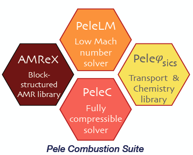

.. highlight:: rst

.. _sec:subsWD:

Introduction
===================

Objectives and State-Of-The-Art
--------------------------------

What we will call the `PeleSuite` is currently composed of 3 separate codes:

- `PelePhysics <https://github.com/AMReX-Combustion/PelePhysics>`_ is a repository of physics databases and implementation code for use within the other `Pele` codes. In particular, the choice of chemistry and transport models as well as associated functions and capabilities are managed in `PelePhysics`.
- `PeleLM <https://github.com/AMReX-Combustion/PeleLM>`_ is an adaptive-mesh Low-Mach number hydrodynamics code for reacting flows. Note that by the time this documentation is written, `PeleLM` does **not** rely on `PelePhysics` yet, and uses in place a `ChemDriver` object. Follow the link to learn more.
- `PeleC <https://github.com/AMReX-Combustion/PeleC>`_ is an adaptive-mesh compressible hydrodynamics code for reacting flows.

All three codes rely on `AMREX <https://amrex-codes.github.io/amrex>`_, which is a software frameworks that provides the data structure and enable massive parallelization.

.. table:: 
   :align: center

   +-----+
   | |a| |
   +-----+

Up until recently, `PelePhysics` (as well as the `ChemDriver` object) depended on DVODE [VODE1989]_ 
to perform the chemistry integration, no matter the problem at hand. 
DVODE is a very robust, but slightly outdated, variable-coefficient Ordinary Differential Equation (ODE) solver written in Fortran 77. 
At its core, it uses a direct dense linear solver. DVODE is very efficient in the resolution of small stiff systems 
of equations but can become prohibitively expensive when dealing with bigger systems of equations, such as those frequently encountered in combustion systems. 
In recent years, the Sundials team at LLNL [LLNL2005]_ have been involved in the active development of a modern, 
C++ version of DVODE called CVODE. 
CVODE implements the same functionalities as those available in DVODE, but offers much more flexibility through 
its user-friendly set of interface routines. Additionally, other linear solvers are available, 
such as iterative or sparse solvers which can prove to be very efficient in handling "larger" systems of equations.

The primary objective of this user-guide is to explain in details the switch that has been put in motion in the `development` branch of `PelePhysics`
from a DVODE to a CVODE based ODE integration; in terms of:

- ODE equations solved (`reactor type`)
- Default solver settings chosen (tolerances/order/...)
- Linear solvers available, along with exemples of performance
- Changes in `PelePhysics` run settings
- Induced changes in the relying codes (such as `PeleC`)
- ...

How to naviguate this documentation
------------------------------------

`This section provides a short summary of the functionalities implemented in the PeleSuite of codes. 
References to sections within the rest of this manuscript are given, for more insights.`

- In `PelePhysics`, **two different reactor types** have been implemented. 
  The first type is a `constant volume` reactor, were the choice of fixed variables are the internal energy and the density, 
  to comply with PeleC transported variables. This reproduces what was originally 
  implemented with DVODE in `PelePhysics`. 
  A second reactor type formulated in terms of enthalpy and density has been put in place, to comply with PeleLM. 
  Both reactors are available either via DVODE (in fortran 90) or CVODE (in cpp).
  See sections :ref:`sec:subsDiffReacts` for additional details, 
  and :ref:`sec:subsPPOptions` to see how to activate one or the other via the input files.

- With both reactors, it is possible to use an **Analytical Jacobian** (depending upon the choice of linear solver, see section :ref:`sec:subslinalg`.)

- Three different **linear solves** can be perfomed, see section :ref:`sec:subslinalg` for additional details, and :ref:`sec:subsPPOptions` to see how to make a selection:
 
    - a dense direct solve
    - a sparse direct solve (requires the KLU library)
    - a sparse iterative solve

- **Regression testings** have been put in place in `PelePhysics` to test the CVODE integration. See section :ref:`sec:subsubValidCVreact` for validations, and section :ref:`sec:subsReactEvalCvode` for a step-by-step example.

- A Cvode version running on **GPU** is currently WIP

- Many modifications to the chemistry-related routines generator `Fuego` have been put in place. 
  The one having the largest impact is that the chemistry files are now divided in two parts: a header file 
  ``chemistry_file.H`` and a C++ file containing the routines definitions. 
  This header file should be imported in any C++ file referencing any Fuego routine. Additionally, a 
  fortran module ``fuego_chemistry`` is defined that should be imported to use Fuego routines from Fortran.

.. [VODE1989] P. N. Brown, G. D. Byrne, and A. C. Hindmarsh. VODE, a variable-coefficient ODE solver. SIAM journal on scientific and statistical computing, 10(5):1038-1051, 1989. 

.. [LLNL2005] A. C. Hindmarsh, P. N. Brown, K. E. Grant, S. L. Lee, R. Serban, D. E. Shumaker, and C. S. Woodward. SUNDIALS: Suite of nonlinear and differential/algebraic-equation solvers. ACM Transactions on Mathematical Software (TOMS), 31(3):363-396, 2005.
