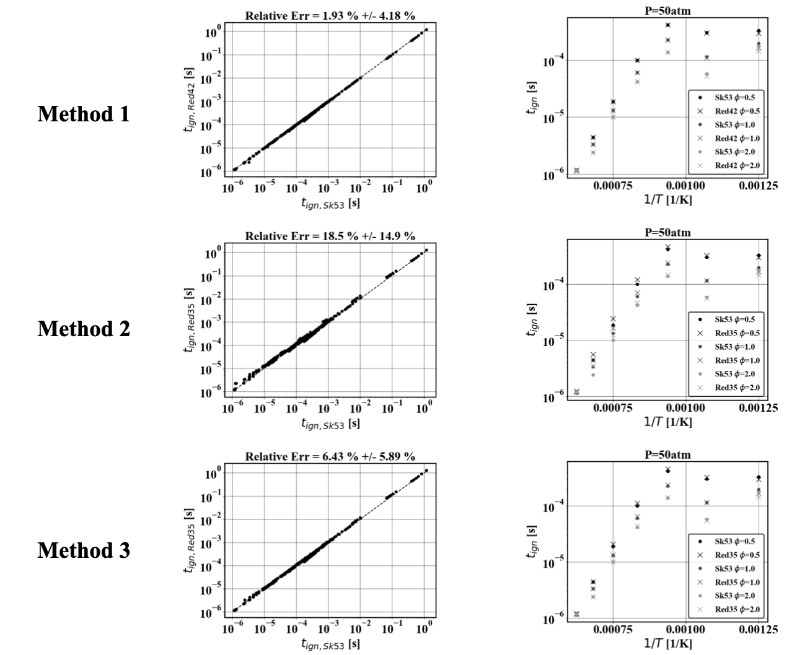

.. highlight:: rst

.. role:: cpp(code)
   :language: c++

Analytically reduced chemistry via quasi-steady state (QSS) assumption in `PelePhysics`
=======================================================================================

.. _sec:QSSAssumption:

The QSS assumption
------------------

Given a detailed chemical mechanism, some species can sometimes be assumed to be in a `quasi-steady state (QSS)`.
Formally, if species :math:`A` is assumed to be in a QSS then

.. math::

    \frac{\partial [A]}{\partial t} = 0,

where :math:`[A]` is the molar concentration of species :math:`A`.
If the set of QSS species is judiciously chosen, macroscopic quantities of interest such as ignition delay or laminar flame speed are only mildly affected by the QSS assumption [DRG2005]_. 

.. _sec:advantageQSS:

The advantage of the QSS assumption
-----------------------------------

Using the elementary reactions of the chemical mechanism, it is possible to write a set of algebraic equations that relate `QSS species` to `non-QSS species`. In turn, it is not necessary to transport the `QSS species` in the flow solver, as their concentration can be directly obtained from the `non-QSS species`. 

In addition, `QSS species` are typically species that induce stiffness in the chemical mechanism since they evolve on scales different that the `non-QSS species`. 

.. _sec:invertAlgebraicSystem:

From `non-QSS species` to `QSS species` concentration
-----------------------------------------------------

The set of algebraic equations that result from the QSS assumption does not always easily result in a simple algebraic relation between a given `QSS species` and all the `non-QSS species`. To do this, it is necessary to apply some form of linearization to the reactions involved [SYS2006]_. In addition, even in presence, of linear relations, `QSS species` may depend on one another. The following figure shows the relation graph between the `QSS species` of a reduced :math:`N-C_{12}H_{26}` mechanism [ND2018]_. The arrows indicate that a `QSS species` concentration depends on another `QSS species` concentration. It can also be seen that dependency groups exist among the `QSS species`. In `PelePhysics` it is possible to deduce invert analytically the linear system of equations given an arbitrary relation graph.

.. _fig:DepGraph:

.. figure:: ./Visualization/directedGraphQSS.png
     :width: 90%
     :align: center
     :name: fig-DRG
     :target: ./Visualization/directedGraphQSS.png
     :alt: Directed graph of dependencies between QSS species 

     Relation graph between QSS species for N-dodecane mechanism [ND2018]_

.. _sec:linearizing:

Linearizing the set of equations
--------------------------------

In general, the QSS assumption results in a set of equations that are non-linearly coupled making it difficult to invert the system. The non-linear relations can arise if two or more `QSS-species` are on the same side of an elementary reaction, or if the stoichiometric coefficient of a `QSS-species` is not equal to one. Below, the relation graph between the QSS species plotted above is expanded with dots that denote reactions that relate `QSS-species`. Dots or species are colored in red if they are involved in a quadratic coupling.

.. _fig:QuadGraph:

.. figure:: ./Visualization/quadGraphQSS.png
     :width: 90%
     :align: center
     :name: fig-Quad
     :target: ./Visualization/quadGraphQSS.png
     :alt: Graph of dependencies between QSS species augmented with reactions. 

     Graph of dependencies between QSS species for N-dodecane mechanism [ND2018]_, augmented with reactions. Red species or dots denote species and reactions involved in quadratic coupling.

From here, it is necessary to eliminate the quadratic coupling to linearize the set of algebraic equations that result from the QSS assumption. Three methods can be envisionned: either one relax the QSS assumption by reducing the set of `QSS species` (Method 1) or one can eliminate the reactions that induce quadratic coupling. In case reactions are reversible, it can happen that either the forward or the backward reaction induce the quadratic coupling. Either one can remove both the forward and the backward reaction (Method 2) or remove either the backward or the forward reaction (Method 3).

All three methods are available in `PelePhysics`. By default, Method 3 is activated as it is computationally efficient and accurarte (as will be shown below). Method 1 is the most accurate and Method 2 is the most computationally efficient in our experience. Given that each method has its own advantage, we decided to allow the user to choose either one according to his/her needs.

.. _sec:validation:

Validation
----------

The three linearization methods are validated against the skeletal :math:`N-C_{12}H_{26}` [SKEL2017]_. Using 343 0D calculation that span the range of applicability of the QSS assumption (:math:`\phi = [0.5, 2.0], p=[1atm, 50atm], T=[800K, 1600K]`), ignition delay is computed using the skeletal mechanism (SK53) and each one of the three linerization methods for the QSS mechanism (RedXX).The left plot shows the correlation between the ignition delay from the skeletal mechanism and the reduced version. The statistics of the relative error between the reduced and the skeletal mechanism are shown in the title of that plot. The right plot shows the ignition delay values at high pressure conditions only.

.. _fig:val:

     Left: Scatter plot of the ignition delay measured with the QSS mechanism linearized and the skeletal mechanism.
     Right: Ignition delays measured for the skeletal mechanism and QSS mechanism linearized at high pressure conditions.
     Top: Method 1. Middle: Method 2. Bottom: Method 3.

Analytical Jacobian
-------------------

In several computational experiments, using analytical Jacobians were found to provide better stability or efficiency compared with finite difference approximation or numerical inversion (see also fig:qss_integrator_).
Compared with non-QSS mechanisms, analytical Jacobians need to reflect the dependence of each QSS species on non-QSS species. However, QSS species may depend on ensemble of other non-QSS species and therefore ensemble of reactions. Therefore, analytical Jacobian cannot be constructed by sequentially adding the contribution of each reaction. This significantly complicates the analytical jacobian generation. Failure to include the dependence of QSS species with respect to non-QSS species typically results in wrong ignition profiles, unless very small timesteps are used, as seen in figure fig:qss_aj_.

.. _fig:qss_aj:

     Temperature of a 0D reactor at constant pressure for NC12H26. Initial temperature is 600K, initial molar fraction of O2 is 0.7 and initial molar fraction of fuel is 0.3. 
     Left: Results without inclusion of dependence of QSS species with respect to non-QSS species.
     Right: Result with inclusion of dependence of QSS species with respect to non-QSS species.

To ease the implementation of analytical Jacobian in presence of QSS species, a symbolic approach is used to construct the analytical Jacobian. This strategy has the advantage of not requiring complex logic, being flexible and readable for future development. For the last row of the Jacobian (partial difference of reaction rate with respect to temperature), finite difference is used since perturbations in temperature are less susceptible to numerical errors than perturbations in species concentrations. During the construction of the reaction rates, the operations printed to file are recorded symbolically using the ``sympy`` and ``symengine`` library [SYMPY]_. For computational efficiency during the symbolic differentiation, the chain-rules terms are computed and the final expressions are computed assembled by chain-ruling using logic internal to `CEPTR` rather than ``sympy``. We have found that this speeds up the Jacobian construction cost by a factor 10. 

Printing the Jacobian terms one by one is not possible since the expressions that include QSS species are typically very large. Instead, the expressions are reduced via common sub-expression precomputing that are later used in each term of the Jacobian. The number of subexpression may be orders of magnitude larger than the number of Jacobian entries which can be problematic if the computational architecture has limited memory.

Several formatting strategies have been implemented to mitigate the memory footprint of the symbolic Jacobian.

.. _optimCuda: https://docs.nvidia.com/cuda/cuda-c-best-practices-guide/index.html

  $ poetry run convert -h
  usage: convert [-h] (-f FNAME | -l LST) [--hformat {cpu,gpu}] [-r1] [-rp] [-rp10] [-moc] [-moca] [-roc] [-sj] [-rd] [-rcse] [-rss]

  Mechanism converter
  
  optional arguments:
    -h, --help            show this help message and exit
    -f FNAME, --fname FNAME
                          Mechanism file
    -l LST, --lst LST     Mechanism directory file list
    --hformat {cpu,gpu}   Sytle format for .H file output. CPU: will print intermediate variables used for chainruling. This gives a readable version of the Jacobian entries, albeit memory consuming. GPU: will not print intermediate variables used for chainruling, and instead will
                          replace them directly in the Jacobian entries. This gives a less readable version of the Jacobian, but more memory efficient.
    -r1, --remove_1       Remove factor 1.0 in printed expressions
    -rp, --remove_pow     Replace pow(...,n) with multiplications or divisions if n<=3 and n>=-3 in printed expressions.
    -rp10, --remove_pow10
                          Remove pow(10,x) in printed expressions and replace it with exp(ln(10)*x).
    -moc , --min_op_count 
                          Counts number operations used to construct each common subexpression and replace the common subexpression if the number of operations is less or equal to the value
    -moca , --min_op_count_all 
                          Similar to --min_op_count but also counts how many times that common subexpression is used later. The meaning value passed is how many more operations will be done if the common subexpression is eliminated. This option only marginally increase the file size
                          (therefore compile time), while still being memory efficient.
    -roc, --gradual_op_count
                          Gradual elimination of common subexpressions. Useful if --min_op_count or --min_op_count_all are active. Loops from 1 to the min_op_count and min_op_count_all values and gradually eliminate the common subexpressions. This has the advantage of ensuring that
                          the memory footprint is strictly monotonically decreasing as min_op_count and min_op_count_all are increased.
    -sj, --store_in_jacobian
                          Use the Jacobian array as a temporary space to store intermediate variables. In particular, the last row of the Jacobian (dependence with respect to temperature) is done by finite difference which requires storing intermediate variables (production rate,
                          forward and backward reactions). When the option is active, the `productionRate` function used to compute the finite difference is replaced with a `productionRate_light` functions where references to different parts of the Jacobian are used in place of
                          allocating new arrays.
    -rd, --round_decimals
                          Round decimal numbers when possible to minimize character count
    -rcse, --recycle_cse  Reuse common subexpressions that are not used later to avoid declaring new temporary reals
    -rss, --remove_single_symbols_cse
                          Remove common subexpressions that are made of 1 symbol. Those common subexpressions are typically `-xxx` and may not appear as worth replacing because they save 1 operations and are reused multiple times. However, when replaced in the later expressions, the
                          `-` operations typically disappear or is merged into another operations which actually does not increase the total number of operatio

The analytical Jacobian for QSS mechanisms is typically more accurate and stable than GMRES, and is on par with the finite difference Jacobian of `CVODE` as seen in fig:qss_integrator_

.. _fig:qss_integrator:

     Temperature of a 0D reactor at constant pressure for NC12H26. Initial temperature is 600K, initial molar fraction of O2 is 0.7 and initial molar fraction of fuel is 0.3. Results are shown for finite difference jacobian (red thick line), analytical jacobian (black line) and GMRES (crosses) using the same tolerances.

In terms of speed, the analytical Jacobian 0D reactor is faster on CPU than finite difference Jacobian and GMRES. For the piston bowl challenge problem, the analytical Jacobian is 1.5 times slower than GMRES with PeleC. Further optimization and tests are still ongoing.

.. [DRG2005] T. Lu, C. K. Law, A directed relation graph method for mechanism reduction, Proceedings of the combustion institute, 30(1):1333-1341, 2005.

.. [SYS2006] T. Lu, C. K. Law, Systematic approach to obtain analytic solutions of quasi steady state species in reduced mechanisms, The Journal of Physical Chemistry A, 110(49):13202-13208, 2006.

.. [ND2018] G. Borghesi, A. Krisman, T. Lu, J. H. Chen, Direct numerical simulation of a temporally evolving air/n-dodecane jet at low-temperature diesel-relevant conditions, 195:183-202, 2018.

.. [SKEL2017] T. Yao, Y. Pei, B. J. Zhong, S. Som, T. Lu, K. H. Luo, A compact skeletal mechanism for n-dodecane with optimized semi-global ! low-temperature chemistry for diesel engine simulations, 191:339-349, 2017. 

.. [SYMPY] Meurer, Aaron and Smith, Christopher P. and Paprocki, Mateusz and \v{C}ert\'{i}k, Ond\v{r}ej and Kirpichev, Sergey B. and Rocklin, Matthew and Kumar, Amit and Ivanov, Sergiu and Moore, Jason K. and Singh, Sartaj and Rathnayake, Thilina and Vig, Sean and Granger, Brian E. and Muller, Richard P. and Bonazzi, Francesco and Gupta, Harsh and Vats, Shivam and Johansson, Fredrik and Pedregosa, Fabian and Curry, Matthew J. and Terrel, Andy R. and Rou\v{c}ka, \v{S}t\v{e}p\'{a}n and Saboo, Ashutosh and Fernando, Isuru and Kulal, Sumith and Cimrman, Robert and Scopatz, Anthony, SymPy: symbolic computing in Python, 3:e103, 2017
