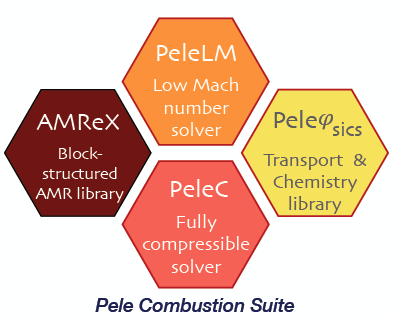

.. PelePhysics documentation master file, created by
   sphinx-quickstart on Sat Oct 20 12:17:48 2018.
   You can adapt this file completely to your liking, but it should at least
   contain the root `toctree` directive.

Welcome to the CHEMISTRY documentation of `PelePhysics`
========================================================

`PelePhysics` is a repository of physics databases and implementation code for use within the other `Pele` codes. In particular, the choice of chemistry and transport models as well as associated functions and capabilities are managed in `PelePhysics`.  `PelePhysics` has an official project `homepage <https://amrex-combustion.github.io/>`_, and can be obtained via
`GitHub <https://github.com/AMReX-Combustion/PelePhysics>`_.  The documentation pages appearing here are distributed with the code in the ``Docs/cvode`` folder as "restructured text" files.  
The html is built automatically with certain pushes to the `PelePhysics` GibHub repository.  A local version can also be built as follows ::

    cd ${PELE_PHYSICS_DIR}/Docs/cvode
    make html

where ``PELE_PHYSICS_DIR`` is the location of your clone of the `PelePhysics` repository.  To view the local pages,
point your web browser at the file ``${PELE_PHYSICS_DIR}/Docs/cvode/build/html/index.html``.

.. table:: 
   :align: center

   +-----+
   | |a| |
   +-----+

.. toctree::
   :maxdepth: 2
   :caption: Documentation contents:

   GettingStarted.rst
   Introduction.rst
   IntroductionToCvode.rst
   CvodeInPP.rst
   QSS.rst
   Ceptr.rst
   Tutorials.rst

Indices and tables
==================

* :ref:`genindex`
* :ref:`search`
