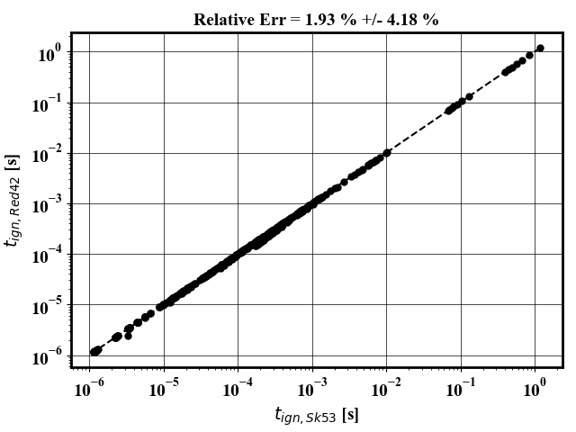
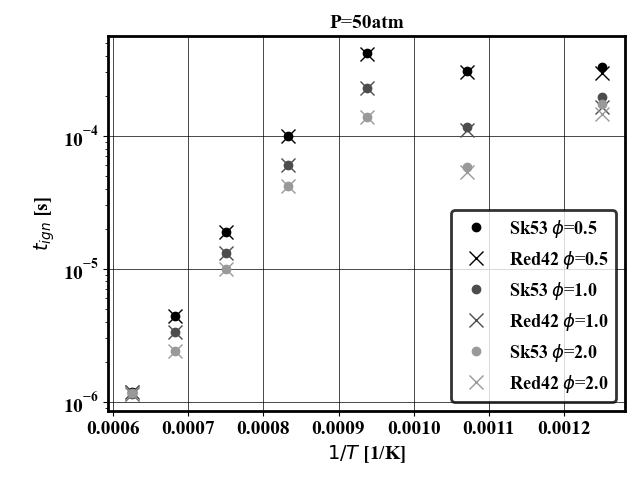
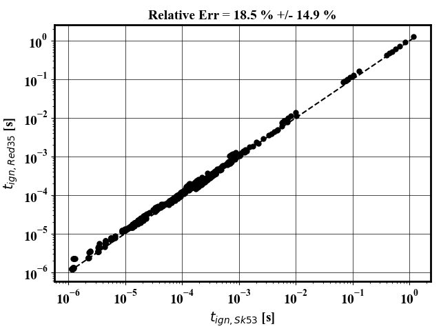
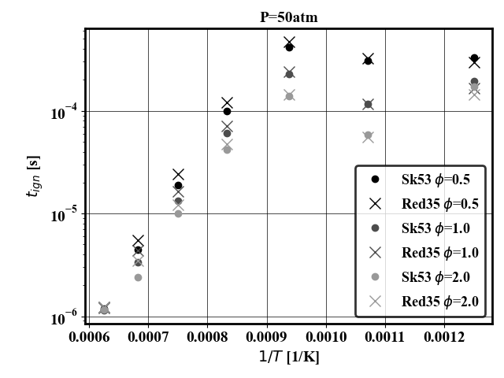
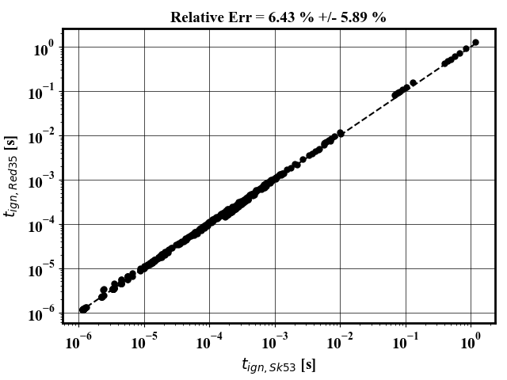
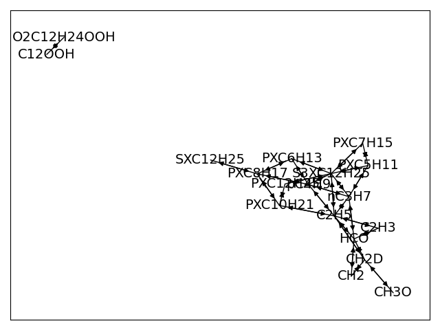
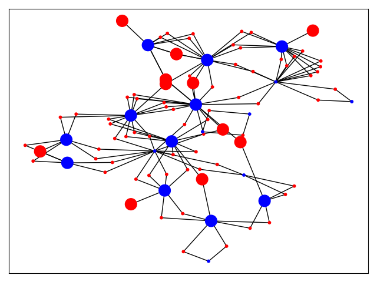

# Analytically Reduced Mechanism
This mechanism is the QSS version.

## Create mechanism

`bash make_mechanism.sh`

## Integration method

Verified with GMRES, denseDirect. Does not work yet with analytical Jacobian

## Remove quadratic coupling

3 methods are available for treatment of the quadratic coupling between QSS species
Result of 0D validation are displayed over the range of applicability of the QSS assumption ()
Left plot shows the correlation with ignition time obtained from 343 calculations spanning the QSS assumption applicability interval.
Right plot shows the ignition time at conditions similar to the KPP problem.

### 1) Species method

The smallest possible set of species that needs to be removed to eliminate quadratic coupling is identified and removed from the QSS species list. To activate it, uncomment the lines under Method 1 in `make_mechanism.sh`

   
   

### 2) Reaction method

All reactions that create a quadratic coupling are removed by eliminating both the forward and backward reaction, even if only the forward or the backward reaction create a quadratic coupling. To activate it, uncomment the lines under Method 2 in `make_mechanism.sh`

   
   

### 3) Some reaction method

All reactions that create a quadratic coupling are removed by eliminating the forward and/or the backward reaction that generate quadratic coupling. To activate it, uncomment the lines under Method 3 in `make_mechanism.sh`

   
   

## Make the dependency graph

`bash make-viztool.sh`

This creates a dependency graph of the QSS species (left) as well as a graph of the reactions that induce quadratic coupling (right). The graphs are outputed in  `qssaTools/output/`

  
  

